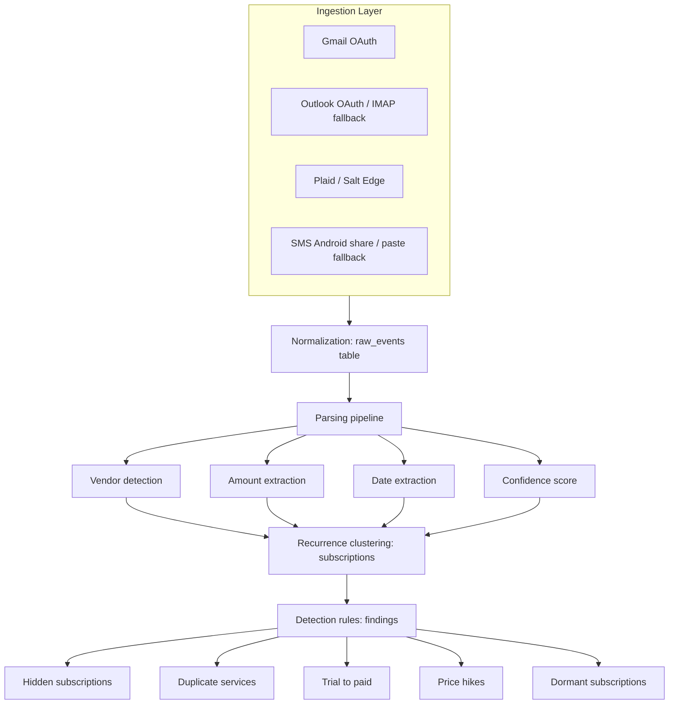

# Ledger Architecture

Phase 1 establishes the deployable foundation for Ledger, a privacy-first
subscription auditor. The product keeps every ingested signal in `raw_events` so
future parser improvements can re-run deterministically without re-fetching
private data.

## System Diagram

## Phase 1 Boundaries

- No Gmail, SMS, or Plaid ingestion logic is implemented yet.
- Auth uses Auth.js v5 with Google and email magic-link providers.
- PostgreSQL access is isolated through Prisma.
- OAuth token helpers encrypt tokens with a per-user key derived from
  `TOKEN_ENCRYPTION_SECRET` and the user id.
- `/api/health` verifies database connectivity with `SELECT 1`.

## Privacy Invariants

- `raw_events` is append-only for ingested signals.
- External scopes must stay read-only: `gmail.readonly` and Plaid
  `transactions:read`.
- Tokens must never be logged.
- PII redaction happens before storing email or SMS bodies in later phases.
- Money is represented as `{ amount_minor: bigint, currency }`, never floats.
